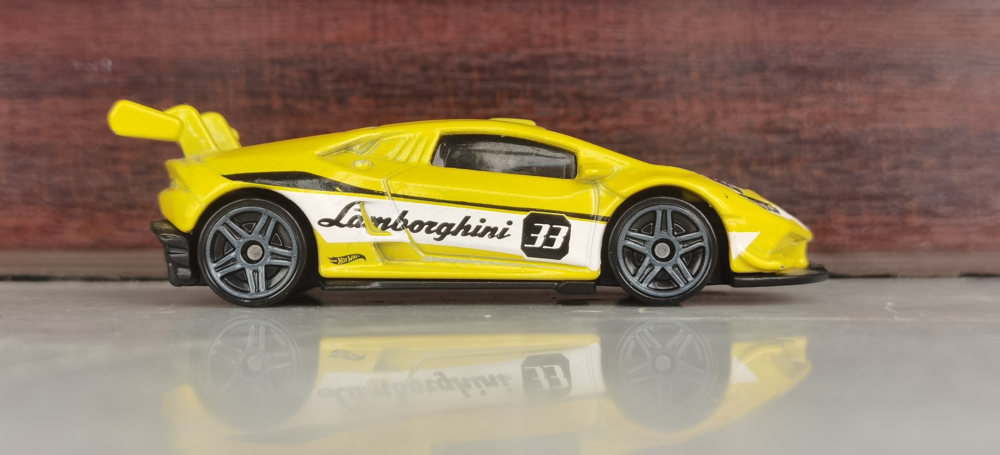
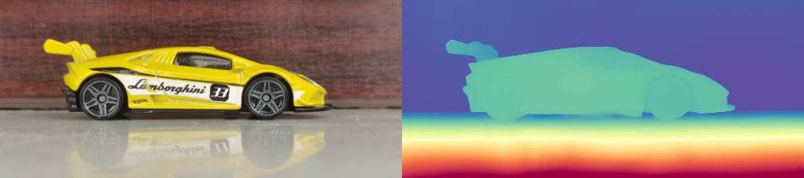

# 3D Reconstruction using Depth Anything V3

This repository implements a high-fidelity **Monocular 3D Reconstruction** pipeline. By leveraging the **Depth Anything V3** foundation model, the system transforms standard 2D images into spatial 3D point clouds without the need for specialized hardware like LiDAR or stereo cameras.

## 🚀 Overview
The core logic involves extracting a high-resolution depth map from a single RGB image and using geometric back-projection (Pinhole Camera Model) to map pixels into 3D space ($X, Y, Z$).

### Key Features
* **Zero-Shot Depth Estimation:** Powered by Depth Anything V3 (ViT-based architecture).
* **3D Point Cloud Generation:** Converts depth maps to `.ply` files for visualization in Open3D, MeshLab, or Blender.
* **RGB Mapping:** Preserves the original texture by mapping the $3 \times H \times W$ image colors onto the $XYZ$ coordinates.

---

## 🛠️ Technical Pipeline
The reconstruction follows a four-step process:

1. **Pre-processing:** Input images are normalized and resized to a $3 \times H \times W$ tensor.
2. **Inference:** The DA3 model predicts a $1 \times H \times W$ depth map representing relative or metric distance.
3. **Geometric Projection:** Using the camera intrinsic matrix $K$, we calculate:
   $$Z = depth$$
   $$X = \frac{(u - c_x) \times Z}{f_x}$$
   $$Y = \frac{(v - c_y) \times Z}{f_y}$$
4. **Post-processing:** Noise filtering and export to the `/result` folder.

---

## 📁 Repository Structure
```text
├── data/               # Input 2D images (RGB)
├── result/             # Generated Depth Maps and .ply Point Clouds
├── src/                # Core model architecture (DA3)
├── da_3d_reconstruction.py  # Main execution script
├── requirements.txt    # Project dependencies
└── README.md           # Documentation
 ```


## 📊 Results

| Input Image (2D) | Reconstructed Point Cloud (3D) |
| :---: | :---: |
|  |  |

> **Note:** The output above shows the spatial depth consistency achieved by the Depth Anything V3 backbone. The 3D point cloud was visualized using Open3D.
> > [!IMPORTANT]
> **Full 3D Assets:** Due to the large file size of high-resolution 3D models, the `.glb` and `.ply` files are stored locally. 
> * **Path:** `results/Sample_img`
> * **Format:** Binary GLTF (includes mesh + RGB textures)
